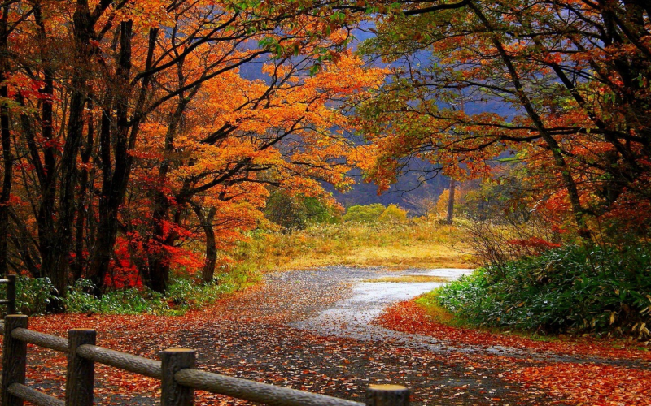

# octreequant [](https://godocs.io/github.com/delthas/octreequant)

A simple library for converting images to paletted images (color quantization) fast.

Quantizing an image takes a substantial amount of time, in the order of a second, so using an optimized algorithm/library matters. This library uses the fastest mainstream quantization algorithm.

Main quantization algorithms:
- Slowest: Generating a palette, then "**brute-forcing**" all the possible palettes for each pixel (what Go's draw.Draw does)
- Fast: Generating clusters of pixels, then cutting the biggest in half on their **median** element until the image has <= N clusters (what https://github.com/soniakeys/quant does)
- Fastest: Adding all the pixel colors to an **octree** (tree with 8 children per node), then pruning the tree bottom-up until it has <= N leafs (**this repo**)

In practice, this library can be typically used to render SIXEL images fast.

On a typical system, encoding a 1000x1000 image takes:
- 2s with the brute-force algorithm
- 0.8s with the median algorithm
- 0.3s with this repo's algorithm

## Usage

```
go get github.com/delthas/octreequant@master
```

The API is well-documented in its [](https://godocs.io/github.com/delthas/octreequant)

To convert an image to a paletted image with a 256-color palette:
```
var in image.Image // = ...
out := octreequant.Paletted(in, 256)
```

## Example

Before quantization:


After quantization:


## License

MIT
